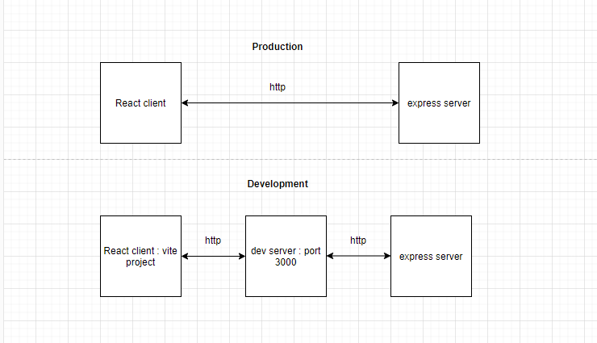

<h2>Motivation</h2>
 Setup typescript react vite project to work with a server (typescript express in this repo) using proxy.
 
 More generally, this current interface is a landing point for any demos. The product that we sell will be completely different.

<h2>Schema</h2>




<h2>Setup</h2>
<ul>
<li>
Add the following to client/vite.config.js
Here /api/v1 is mapped to http://localhost:3000/ which is where the server resides

```
server: {
    proxy: {
      "/api/v1": "http://localhost:5000/",
    },
  },

```

</li>
<li>The react app uses /api/v1 as base url and the server base endpoint url is /api/v1</li>
<li>Using /api/v1 as base url is arbitrary. Notice however that it appears in 3 places : client/vite.config.js , on the client side source files and on the server side source files</li>
</ul>

<h2>Installation</h2>
<ul>
<li>
Perform the following from root directory , client directory and server directory

```
npm i

```
</li>
<li>Make sure concurrently and ts-node (used for server) are installed globally</li>
</ul>
<h2>Usage</h2>
Invoke from the root project to run the server and the client. This is done using concurrently

```
npm run dev
```
<h2>Phone Calling</h2>
The kairos.care.dev@gmail.com account will be used to sign into both Twilio and ngrok

For ngrok set-up, run:

```
brew install ngrok

ngrok config add-authtoken 2tx2jXYhsd4YROMzi9m4DupwdMu_5hWewv95tS46L6DLGJFU5
```

To start the https server, run:

```
ngrok http 3000
```

Copy the ngrok link that appears as a wrapper around http://localhost:3000

For Twilio setup:


Paste the endpoint link in Develop -> Phone Numbers -> Manage -> Active numbers -> Configure -> POST Url

The above must be done every time the ngrok is restarted

Phone Number: (949) 776-3549

<h2>Limitation</h2>
i was not able to map "/" because then localhost:3000/ is used

<h2>Multi-Caller Conference Support</h2>

The system now supports multiple callers in a conference call with proper speaker identification. Each caller's audio stream is processed separately, and their phone number is used as the speaker ID for transcription.

<h3>Key Features</h3>

- Each caller in the conference gets their own dedicated transcription stream
- Phone numbers are used as speaker IDs instead of relying on diarization
- Transcriptions are properly attributed to the correct speaker
- Conference events are tracked for better call management

<h3>Implementation Details</h3>

1. **WebSocketHandler**: Now maintains a map of TranscriptionManager instances, one for each caller
2. **TranscriptionManager**: Uses the caller's phone number as the speaker ID throughout the transcription process
3. **Twilio Configuration**: Each caller's stream is tracked separately with the `track` parameter
4. **Conference Events**: A new endpoint `/conference-events` tracks conference participation

<h3>Performance Benefits</h3>

- Reduced latency by eliminating the need for speaker diarization
- More accurate speaker identification
- Better handling of overlapping speech
- Improved scalability for multiple participants

